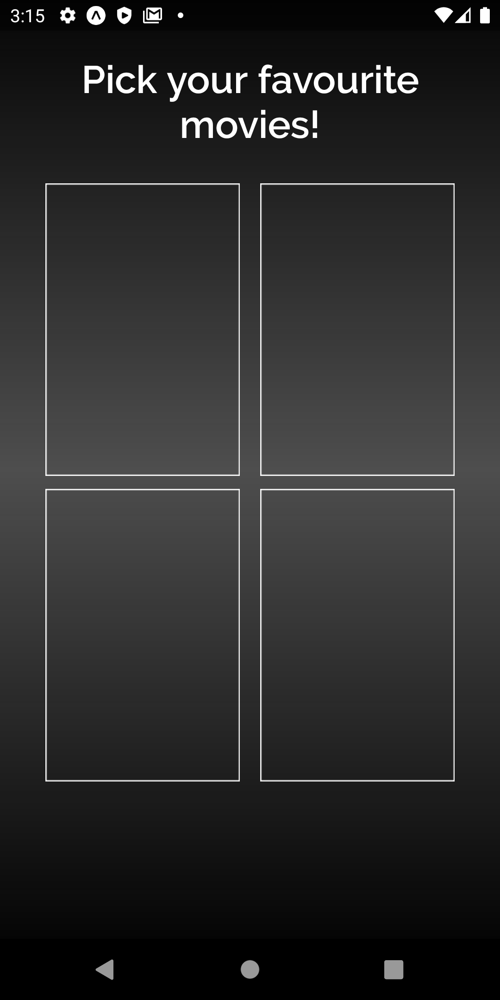
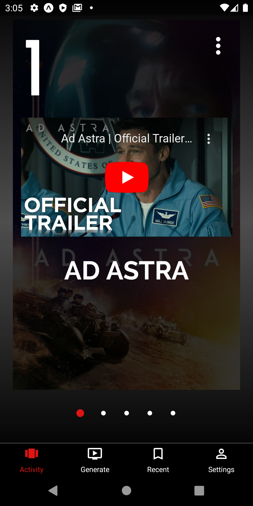
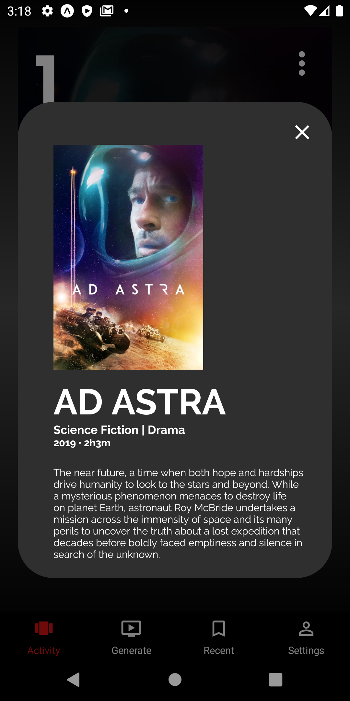
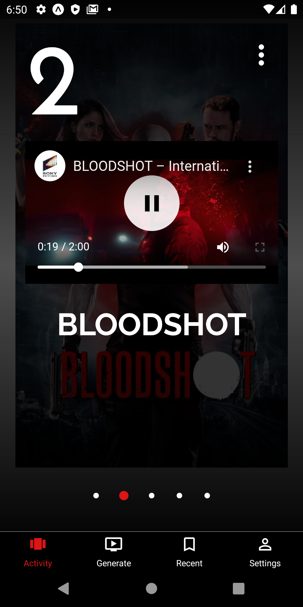
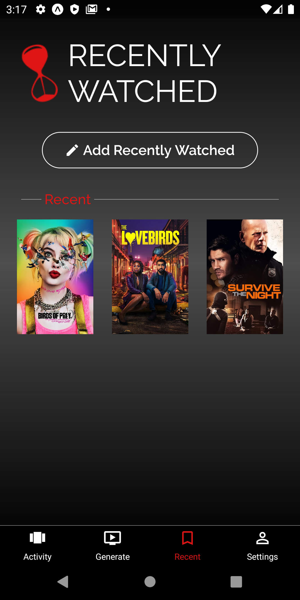
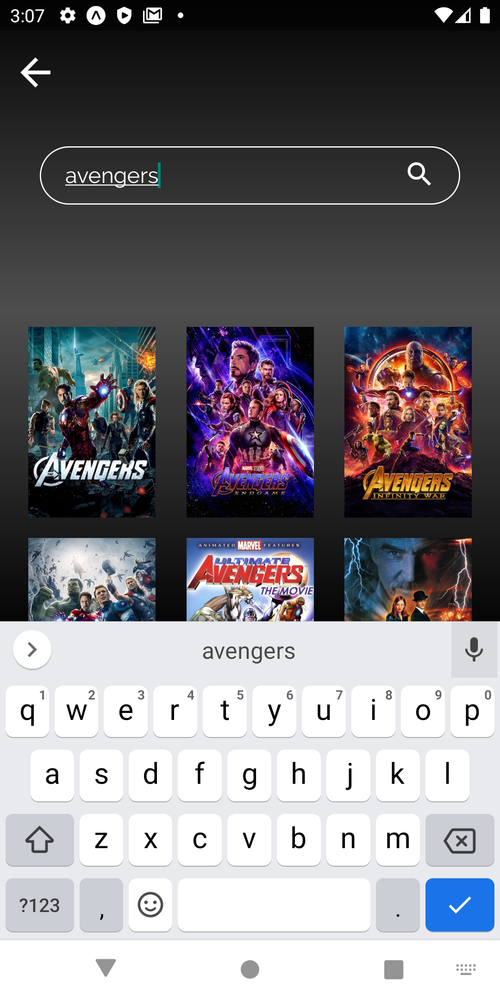

# movie-suggestor

This is how our app looks like!

Developers: <a href="https://github.com/sahifa-shahid">Sahifa Shahid</a> and <a href="https://github.com/SarimDEV"> Muhammad Sarim</a>

ML algorithm can be found 

 
  
  
  
  

 
  
  
  
  

  
  
  
  

  
  
  

